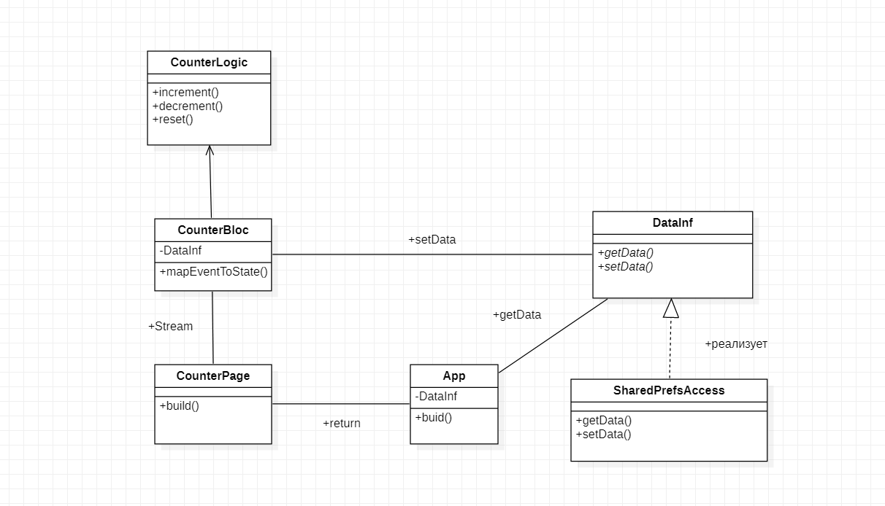

# clean_counter

Приложение "Счетчик" написанное на Flutter, руководствуясь принципами чистой архитектуры.

## UML-диаграмма классов приложения

Класс **App** возвращает страницу **CounterPage**. Она с помощью соответствующих виджетов (BlocProvider, BlocBuilder) связана с компонентом бизнес-логики (BLoC), который реализован пакетом **flutter_bloc**. CounterPage передает события IncrementEvent, DecrementEvent, ResetEvent при нажатии на соответсвующие кнопки пользователем.

В классе **CounterLogic** содержится вся высокоуровневая логика приложения. Она не связана с фреймворком, слоем данных и внешними зависимостями. Здесь определяются три метода, изменяющие целое значение некоторым образом: увеличение, уменьшение, приравневание к нулю.

Компонент бизнес логики **CounterBloc** наследуется от **CounterLogic**. В своем методе **mapEventToState** он в зависимости от произошедшего события, вызывает соответсвующий метод класса **CounterLogic**.
Одним из атрибутов класса **CounterBloc** является экземпляр класса **DataInf**. Это абстрактный класс (интерфейс) **DataInf** объявляющий два метода: getData и setData.
Его реализует класс **SharedPrefsAccess**, который предоставляет способ хранения данных в Shared Preference. 
В зависимости от некоторых обстоятельств, например, от платформы, может потребоваться использовать другие реализации этого интефрейса. Для этого будет применяться условное выражение. 
